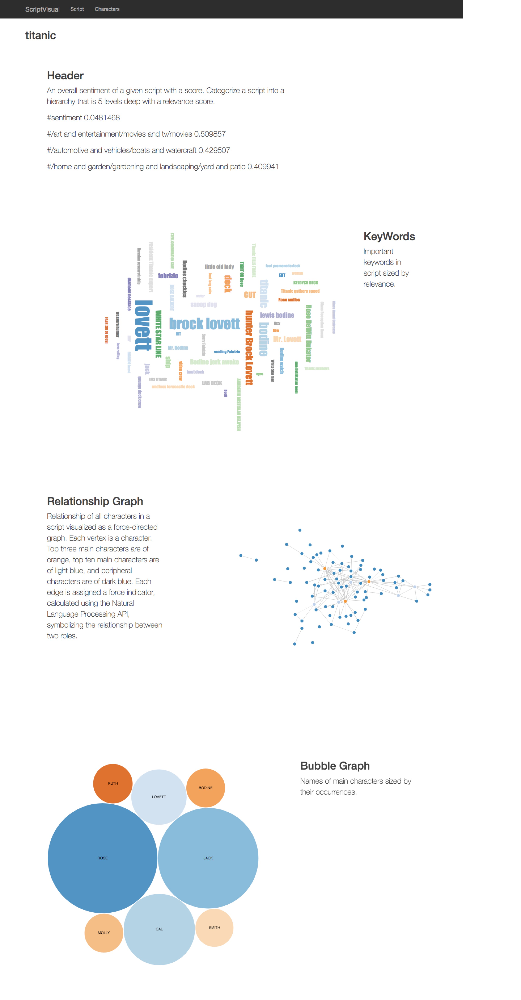
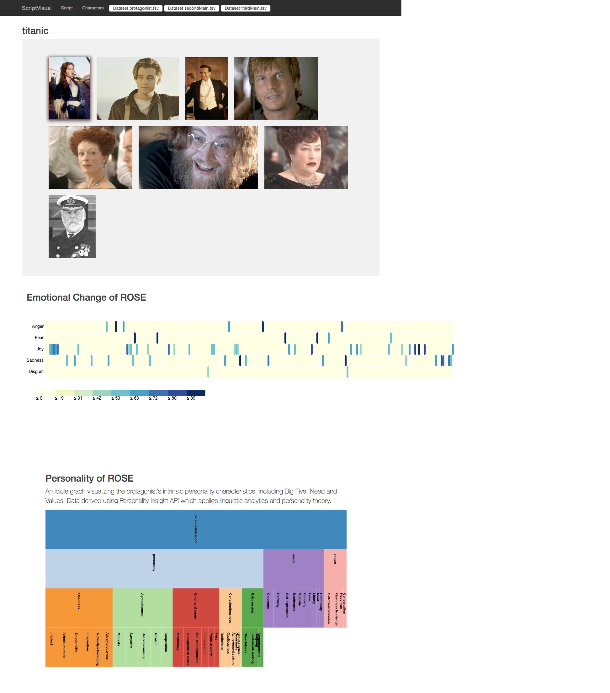

Movie Script Visualization Project

This program was created as a final project of CIT 591 Intro to Software Engineering, University of Pennsylvannia.

Authors: Yichao Li, Yue Yin, Siyang You

The project is a moive script visualization application. It scratches the script of any movie by user's choice, analyzes the script and associated data, and finally visualizes the results. The basic work flow is listed as follows:

1. User searches by typing in a movie name or by choosing a movie genre.
2. When user makes an accurate search, if a script for that movie exists, that result will show up. When user makes a partial search, up to three related movies will be displayed.
3. Then user chooses a movie to visualize . The movie script is cut into chunks and character name, dialogue and narrative are extracted from each chunk. Then the script is analyzed chunk by chunk and a graph with characters as vertex and relationships between two characters as edge. Content of the Script is sent to the Watson Natural language Understanding API, Watson Personality Insights API and Watson Toner Analyzer API. After the program finishes analyzing, it out put a series of files locally with data analysis of keywords, emotion, sentiment, personalities and so on, which are futher visualized using Javascript and HTML
4. The results are displayed on webpage. The main characters, character's emotional changes, and the relationship between characters will be shown with graphs like circles, lines and bars.

Technologies utilized: Java, Google Customer Search API, IBM Watson API, TMDb API, WindowBuilder, Jsoup, JGrapht, JavaScript, HTML, Bootstrap

Visualization dirived from:

Copyright (c) 2016, Tom May 

Copyright (c) 2013, Jason Davies.

Copyright (C) 2007 Free Software Foundation, Inc. <http://fsf.org/>

Jsoup: Copyright © 2009 - 2017 Jonathan Hedley

JGrapht: Copyright (C) 1991, 1999 Free Software Foundation, Inc.
